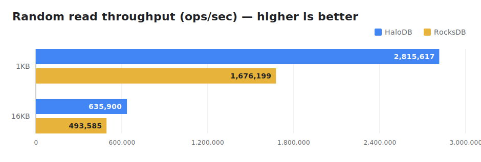
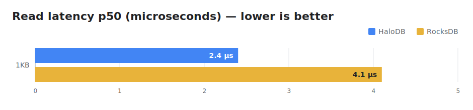
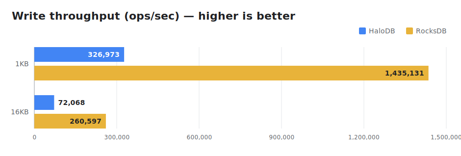
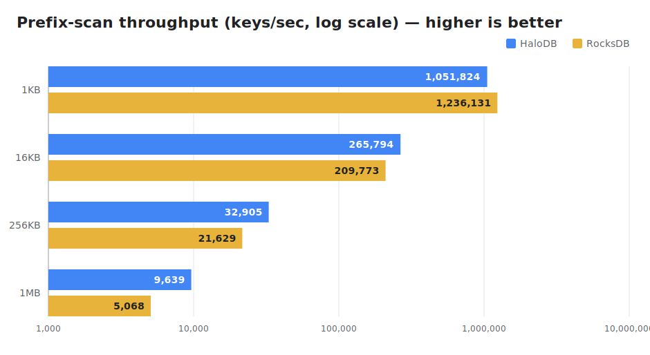

# Storage Engine Benchmarks

An sbt subproject that benchmarks HaloDB, including a side-by-side comparison against RocksDB.
It depends on the HaloDB source directly, so it always builds against the current tree (no
`publishLocal` needed). Requires **Java 22+** like the main project.

## Side-by-side comparison (HaloDB vs RocksDB)

`Comparison` runs an identical workload — fill, multithreaded random reads, then prefix scans —
against each engine and prints their write throughput, read throughput/latency, and prefix-scan
throughput next to each other. Both engines see the same keys and the same random read order (fixed
seed), so the numbers are directly comparable. HaloDB's prefix scan uses the ordered index
(`setUseOrderedIndex`); RocksDB's uses a `RocksIterator` over its sorted keyspace.

```bash
sbt "benchmarks/run quick"     # ~2M x 1KB records, fits in RAM — fast iteration
sbt "benchmarks/run large"     # 40M records, exceeds RAM so reads hit disk
```

Override any preset value, or pick engines:

```bash
sbt "benchmarks/run quick --records=5000000 --record-size=512 --reads=10000000 --read-threads=16"
sbt "benchmarks/run quick --key-size=1024"           # large keys (default 8 B; min 8 B)
sbt "benchmarks/run quick --engines=halodb"          # one engine only
sbt "benchmarks/run quick --rocks-compress=true"      # enable RocksDB LZ4 compression
sbt "benchmarks/run quick --dir=/mnt/ssd/bench"        # data directory (default: target/benchmark-data)
```

`--key-size` sweeps key length to measure the point-read/write path on large keys. Prefix scan is
skipped when `key-size` exceeds 127 (HaloDB's ordered index requires fixed keys ≤ 127 B); large keys
still work for point reads/writes via the hash index.

Sample results (one workstation, in page cache — directional only). See
[`docs/benchmarks.md`](../docs/benchmarks.md) for the full write-up.









Reading the three dimensions:
* **Point reads** — HaloDB wins (read-amplification-1), ~1.2–1.6x.
* **Writes** — RocksDB wins (LSM), ~3.6–4.4x.
* **Prefix/range scans** — competitive across the board; HaloDB strongest at mid-to-large records. It
  seeks to the prefix's subtree in the ordered index and reads each matched record via its point-read
  path; RocksDB iterates its sorted keyspace. HaloDB is ~0.88x RocksDB at **1KB** but pulls ahead as
  the per-record read becomes transfer-bound: **1.41x** at 16KB, **1.47x** at 256KB, peaking at
  **2.09x** at 1MB, then narrowing to **~1.3x** at 10MB as both engines converge on the raw IO ceiling
  (note the log-scale axis above; the 10MB point is the noisiest, ~11 blocks/pass).

### Reading the results — caveats

Engine comparisons are sensitive; treat the output as directional on your hardware, not an absolute
ranking:

- **Dataset vs RAM.** `quick` fits in page cache, so reads measure each engine's CPU/index path;
  `large` exceeds RAM so reads hit disk — closer to HaloDB's real-world target.
- **Durability profile.** RocksDB runs with the WAL disabled (memtable writes); HaloDB flushes to
  the OS page cache rather than fsync-ing per write. Neither is durable per write, which keeps the
  write comparison roughly like-for-like.
- **Compression.** RocksDB compression is **off** by default for a like-for-like comparison with
  HaloDB (which stores values raw); `--rocks-compress` enables LZ4.
- **Config.** Both engines use a fixed, reasonable config (see `HaloDBStorageEngine` /
  `RocksDBStorageEngine`); tuning either changes the picture.

## Single-engine deep benchmark

`BenchmarkTool` is the original, large-scale single-engine harness (`FILL_SEQUENCE`, `FILL_RANDOM`,
`READ_RANDOM`, `RANDOM_UPDATE`, `READ_AND_UPDATE`):

```bash
sbt "benchmarks/runMain com.oath.halodb.benchmarks.BenchmarkTool <db directory> READ_RANDOM"
```
