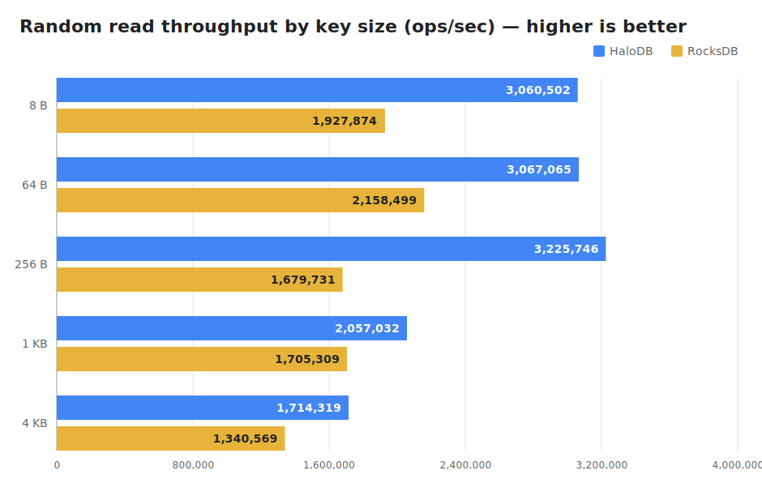
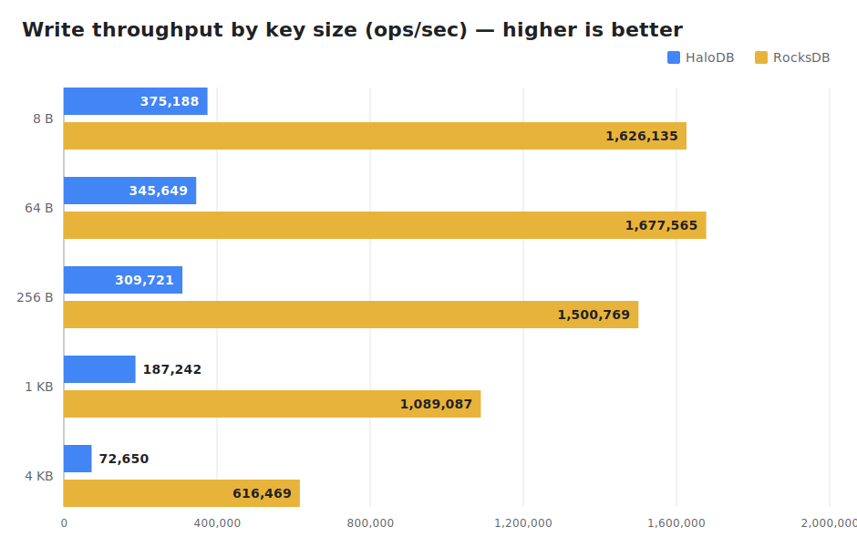

# Benchmarks

HaloDB is benchmarked side-by-side against [RocksDB](https://rocksdb.org) (`rocksdbjni` 10.10.1)
using the [`benchmarks`](../benchmarks) sbt subproject, which builds against the current HaloDB
source. The comparison covers the three dimensions where the engines differ most: **point reads,
writes, and prefix/range scans**.

> These numbers were collected on a single developer workstation (Oracle GraalVM 25, NVMe SSD) with
> the dataset resident in the OS page cache, so they are **directional** — what matters is the
> relative behavior; absolute numbers depend on your hardware, dataset-vs-RAM ratio, and tuning.
> Reproduce with `sbt "benchmarks/run quick"` (see the [benchmark module](../benchmarks)).

## Setup

- 8-byte keys; values of **1KB** (small) and **16KB** (large) for the write/read comparison.
- 2,000,000 records (1KB) / 300,000 records (16KB) — fits in page cache.
- Reads are random (fixed seed) across all keys.
- Prefix scans are swept across **1KB, 16KB, 256KB, 1MB, and 10MB** values (record count chosen to
  keep each dataset page-cache resident: 30,000 records at 256KB, 10,000 at 1MB, 3,000 at 10MB) to
  show how the engines diverge as records grow.
- HaloDB runs with the ordered index enabled (`HaloDBOptions.setUseOrderedIndex(true)`) so prefix
  scans are available; RocksDB scans via a `RocksIterator` over its sorted keyspace. Prefix scans
  read ~256-key blocks, touching each matched value.

## Results

| metric | 1KB · HaloDB | 1KB · RocksDB | 16KB · HaloDB | 16KB · RocksDB |
| --- | ---: | ---: | ---: | ---: |
| WRITE ops/sec   | 326,973   | 1,435,131 | 72,068  | 260,597 |
| READ ops/sec    | 2,640,415 | 1,705,611 | 677,922 | 554,765 |
| READ p50 (µs)   | 2.4       | 4.1       | —       | —       |
| PREFIX keys/sec | 1,079,254 | 1,223,735 | 283,423 | 201,671 |

### At a glance

> Charts are generated from the data above by [`images/generate_charts.py`](images/generate_charts.py)
> (no dependencies) — re-run it after a fresh benchmark to refresh them.

### Point reads — HaloDB wins (~1.2–1.6×)

HaloDB keeps all keys in an in-memory index and stores values in append-only log files, giving
**read amplification of 1**: at most one disk seek per `get`, with submillisecond latency. RocksDB's
LSM may consult several levels per read (mitigated by bloom filters). This is HaloDB's core strength.

### Writes — RocksDB wins (~3–4.6×)

RocksDB's LSM buffers writes in an in-memory memtable and flushes sequentially, so ingest is very
fast. HaloDB appends each record to its log and updates the index; durable and simple, but lower raw
write throughput. This is the trade-off HaloDB makes in favor of read latency and crash-recovery
simplicity.

### Prefix/range scans — competitive across the board, HaloDB strongest at mid-to-large records

Prefix scanning is available via HaloDB's optional ordered index — an off-heap
[adaptive radix tree](https://db.in.tum.de/~leis/papers/ART.pdf) of the key set maintained alongside
the hash index. A scan seeks directly to the prefix's subtree (O(prefix length + matches)) and reads
each matched record through the normal point-read path; RocksDB iterates its sorted keyspace,
reading values sequentially.

The margin varies with record size — as the per-record read shifts from overhead-bound to
transfer-bound, HaloDB's one-seek-per-record approaches optimal while RocksDB's sequential iteration
loses its edge — then both converge again once raw IO bandwidth dominates:

| value size | HaloDB keys/sec | RocksDB keys/sec | HaloDB vs RocksDB |
| --- | ---: | ---: | ---: |
| 1KB   | 1,079,254 | 1,223,735 | 0.88× |
| 16KB  | 283,423   | 201,671   | 1.41× |
| 256KB | 26,071    | 17,702    | 1.47× |
| 1MB   | 8,610     | 4,124     | **2.09×** |
| 10MB  | 454       | 355       | 1.28× |

So HaloDB starts slightly behind on tiny records, pulls ahead as records grow — **peaking around 2×
at ~1MB** — and then the margin narrows again at 10MB. That shape is exactly what the physics
predicts: once the scan is fully transfer-bound, both engines are streaming the same bytes off the
same device, so they converge toward the raw IO ceiling and the ratio drifts back toward parity. (The
10MB point reads only ~11 blocks per pass, so it's the noisiest row — treat it as "roughly tied,
HaloDB a bit ahead.") Net: HaloDB's prefix scanning is competitive across the board and strongest in
the mid-to-large range it targets. The ordered index does not change point-read latency (the hash
index is untouched); its cost is per-write maintenance and roughly 2× index memory, and it requires
fixed-length keys.

## Key-size scaling

HaloDB supports **keys of any length** (the 127-byte cap was removed). With the memory pool, keys
longer than `fixedKeySize` overflow into chained slots; with the non-pool index they're stored
inline. To show how key size affects the point-read/write path, the workload below holds the value
size constant (256 B, 500,000 records) and sweeps the key from 8 B to 4 KB. (Prefix scan is omitted
here — the ordered index still requires fixed keys ≤ 127 B.)

| key size | WRITE · HaloDB | WRITE · RocksDB | READ · HaloDB | READ · RocksDB | READ p50 · HaloDB | READ p50 · RocksDB |
| --- | ---: | ---: | ---: | ---: | ---: | ---: |
| 8 B   | 375,188 | 1,626,135 | 3,060,502 | 1,927,874 | 1.9 µs | 3.8 µs |
| 64 B  | 345,649 | 1,677,565 | 3,067,065 | 2,158,499 | 1.8 µs | 3.5 µs |
| 256 B | 309,721 | 1,500,769 | 3,225,746 | 1,679,731 | 1.9 µs | 4.3 µs |
| 1 KB  | 187,242 | 1,089,087 | 2,057,032 | 1,705,309 | 3.2 µs | 4.1 µs |
| 4 KB  |  72,650 |   616,469 | 1,714,319 | 1,340,569 | 4.1 µs | 5.2 µs |

**Reads stay HaloDB's strength at every key size** — higher throughput and lower p50 latency than
RocksDB from 8 B all the way to 4 KB, because a read is still one seek regardless of key length.
**Writes cost more as keys grow:** HaloDB must append the full key to its log and (with the memory
pool) thread it across chained index slots, so write throughput falls off faster than RocksDB's as
keys get large. Large keys therefore fit HaloDB's read-heavy sweet spot well; very large keys on a
write-heavy workload are where RocksDB's gap widens. As always, benchmark your own key/value mix.

## Why HaloDB makes these trade-offs

HaloDB was written for read-latency-critical, IO-bound workloads of large records. It optimizes for
exactly that — one disk seek per read, low and predictable tail latency — and accepts lower write
throughput and a smaller feature set than a general-purpose engine like RocksDB. As the numbers show,
it is not universally faster; it is faster *where it was designed to be*. Always benchmark your own
workload.

## Historical benchmark

The original large-scale benchmark (500M records ≈ 500GB, on a 128GB Xeon server, vs RocksDB and
KyotoCabinet) from the upstream Yahoo project is preserved in this file's
[git history](https://github.com/yahoo/HaloDB/blob/master/docs/benchmarks.md).
