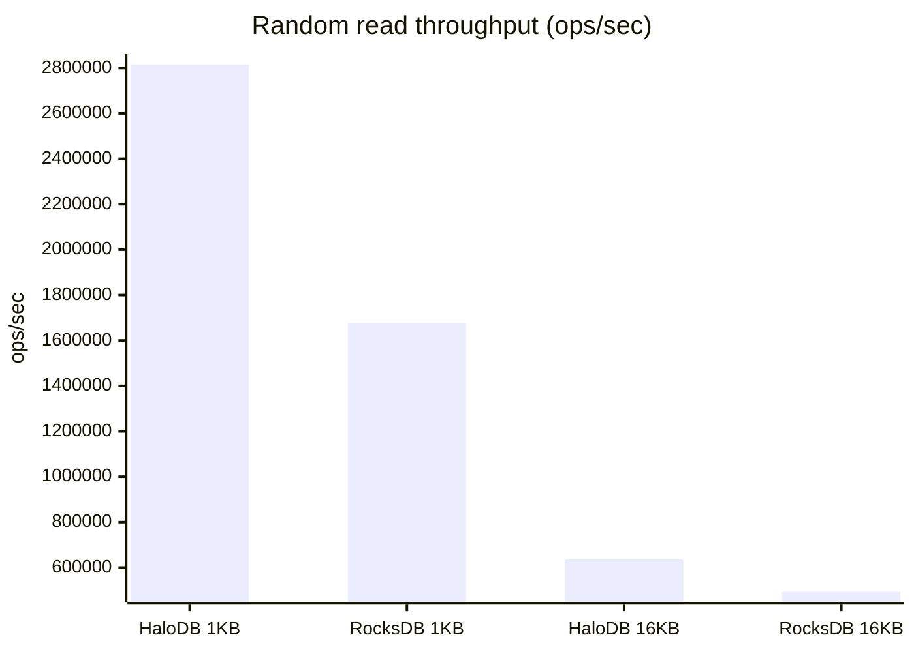
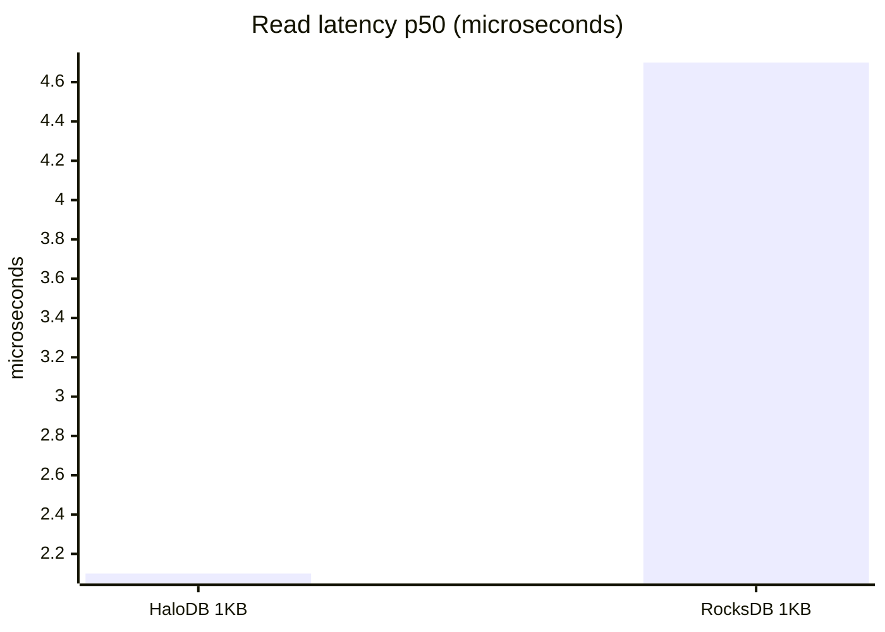
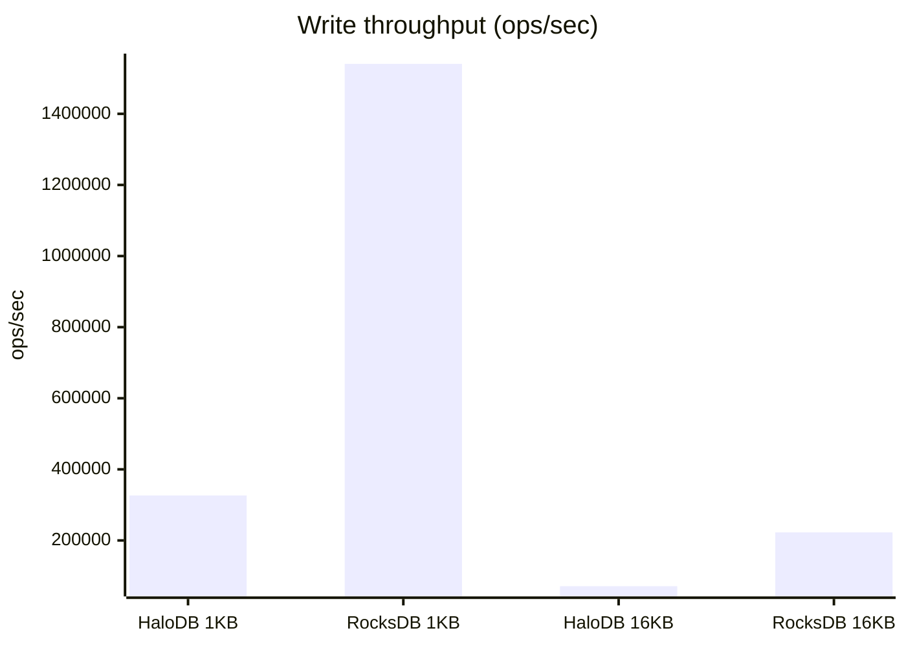
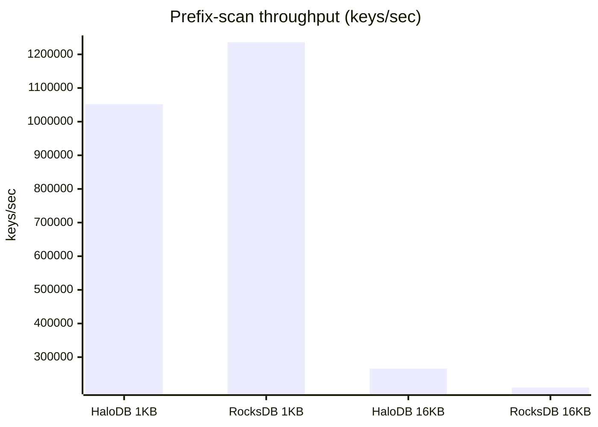

# Benchmarks

HaloDB is benchmarked side-by-side against [RocksDB](https://rocksdb.org) (`rocksdbjni` 10.10.1)
using the [`benchmarks`](../benchmarks) sbt subproject, which builds against the current HaloDB
source. The comparison covers the three dimensions where the engines differ most: **point reads,
writes, and prefix/range scans**.

> These numbers were collected on a single developer workstation (Oracle GraalVM 25, NVMe SSD) with
> the dataset resident in the OS page cache, so they are **directional** — what matters is the
> relative behavior; absolute numbers depend on your hardware, dataset-vs-RAM ratio, and tuning.
> Reproduce with `sbt "benchmarks/run quick"` (see the [benchmark module](../benchmarks)).

## Setup

- 8-byte keys; values of **1KB** (small) and **16KB** (large).
- 2,000,000 records (1KB) / 300,000 records (16KB) — fits in page cache.
- Reads are random (fixed seed) across all keys.
- HaloDB runs with the ordered index enabled (`HaloDBOptions.setUseOrderedIndex(true)`) so prefix
  scans are available; RocksDB scans via a `RocksIterator` over its sorted keyspace. Prefix scans
  read ~256-key blocks, touching each matched value.

## Results

| metric | 1KB · HaloDB | 1KB · RocksDB | 16KB · HaloDB | 16KB · RocksDB |
| --- | ---: | ---: | ---: | ---: |
| WRITE ops/sec   | 326,630   | 1,540,575 | 71,183  | 222,664 |
| READ ops/sec    | 2,815,617 | 1,676,199 | 635,900 | 493,585 |
| READ p50 (µs)   | 2.1       | 4.7       | —       | —       |
| PREFIX keys/sec | 1,051,824 | 1,236,131 | 265,794 | 209,773 |

### At a glance

Random read throughput — **ops/sec, higher is better** (HaloDB wins ~1.3–2×):

Read latency — **p50 µs, lower is better** (1KB, page-cache resident):

Write throughput — **ops/sec, higher is better** (RocksDB wins ~3–4.6×):

Prefix-scan throughput — **keys/sec, higher is better** (on par; HaloDB faster at 16KB):

### Point reads — HaloDB wins (~1.3–2×)

HaloDB keeps all keys in an in-memory index and stores values in append-only log files, giving
**read amplification of 1**: at most one disk seek per `get`, with submillisecond latency. RocksDB's
LSM may consult several levels per read (mitigated by bloom filters). This is HaloDB's core strength.

### Writes — RocksDB wins (~3–4.6×)

RocksDB's LSM buffers writes in an in-memory memtable and flushes sequentially, so ingest is very
fast. HaloDB appends each record to its log and updates the index; durable and simple, but lower raw
write throughput. This is the trade-off HaloDB makes in favor of read latency and crash-recovery
simplicity.

### Prefix/range scans — roughly on par; HaloDB faster for large records

Prefix scanning is available via HaloDB's optional ordered index — an off-heap
[adaptive radix tree](https://db.in.tum.de/~leis/papers/ART.pdf) of the key set maintained alongside
the hash index. A scan seeks directly to the prefix's subtree (O(prefix length + matches)) and reads
each matched record through the normal point-read path; RocksDB iterates its sorted keyspace,
reading values sequentially.

The margin depends on record size: for **small (1KB)** records HaloDB is ~0.85× RocksDB (the
per-record read is overhead-bound), and for **large (16KB)** records HaloDB is **~1.3× faster** (the
read becomes transfer-bound, so HaloDB's one-seek-per-record is near-optimal). HaloDB's prefix
scanning is therefore competitive across the board and strongest for large records — the workload it
targets. The ordered index does not change point-read latency (the hash index is untouched); its
cost is per-write maintenance and roughly 2× index memory, and it requires fixed-length keys.

## Why HaloDB makes these trade-offs

HaloDB was written for read-latency-critical, IO-bound workloads of large records. It optimizes for
exactly that — one disk seek per read, low and predictable tail latency — and accepts lower write
throughput and a smaller feature set than a general-purpose engine like RocksDB. As the numbers show,
it is not universally faster; it is faster *where it was designed to be*. Always benchmark your own
workload.

## Historical benchmark

The original large-scale benchmark (500M records ≈ 500GB, on a 128GB Xeon server, vs RocksDB and
KyotoCabinet) from the upstream Yahoo project is preserved in this file's
[git history](https://github.com/yahoo/HaloDB/blob/master/docs/benchmarks.md).
